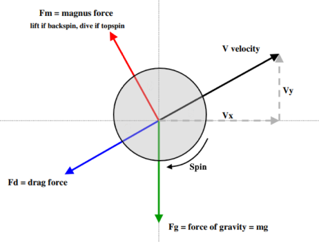
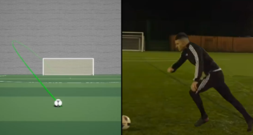
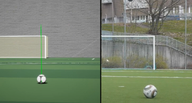
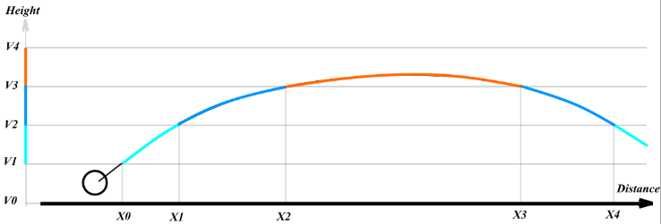

# PHYSICS ENGINE

Good soccer game is impossible without proper physics engine. 
Unreal Engine 4 has built-in PhysX which is perfect for wide range of tasks but it is not so flexible and optimized when more complex features required besides basic collision resolution, ragdoll simulation, etc.

There are some vital requirements for physics engine in the context of a soccer game:
- Stable and controllable update interval (FPS);
- Ability to predict ball motion precisely within desired amount of time;
- Ability to simulate complex ball aerodynamics;
- Tools for fast and efficient computation of ball launch conditions to reach hit target during gameplay;
- Other basic features, like collision handling, friction, support of physics materials, etc.

## BASIC FEATURES

Physics engine consists of two main elements: **PhysicsProcessor** and **PhysicsComponent**.

**PhysicsProcessor** is a singleton object responsible for:
- Update of each custom physical object in the scene;
- Collision resolution with custom and default objects (if any);
- Tracking of each object with collision enabled and providing interface for motion prediction.

**PhysicsComponent** is just a scene component. It subscribes to PhysicsProcessor and replaces default physics when enabled. 

We can decide which objects should be tracked for physics update. For example, ground is static object with collision. 
We attach base physics component to it for taking that specified collision into account.

Update loop is based on World DeltaTime (scene FPS). Although it is extremely desirable to maintain update rate fixed and stable (30 or 60 FPS), deviations are inevitable.
Physics engine provides mechanism to keep things synced. All computations for prediction are made in fixed short time steps (about 120 FPS). 
When World has been updated by arbitrary DeltaTime this value is divided to integer number of physics steps and the simulation is moving forward. 
Linear interpolation within single physics FPS is used to take fractional reminder of DeltaTime into account.

Other features:
- Easy enable/disable at runtime;
- Support of default colliders and PhysicsMaterials;
- Friction model is Coulomb Friction (like in PhysX);
- Capability to decide which colliders should be included/excluded for calculations; 
- Simulation of impulse impact without real influence on the object.

To avoid of overengineering it worth bear in mind, that in game we won't have too much moving colliders and motion prediction is required only for one object - the ball. 
Quadtrees and other optimisation methods barely will impact on performance. 

## MOTION PREDICTION

It is crucial to know how ball will move in the future. Without this knowledge other more complex systems can't be built. 
In the game ball may experience forces from two main impact sources:   

- **Passive sources** (static collisions like with field, goalpost; gravity and aerodynamic forces);
- **Active sources** (kick impact that is applied from gameplay code; collisions with freely moving objects like player feet, other ball);

On the on hand, passive sources are simple to take into account when we loop over physics iteration ahead of time to build resulting trajectory.  
On the other hand, impact from active sources is "unexpected" in the moment when prediction was calculated.

On practice active sources occur at times less frequently than passive, so basic algorithm looks like that:

1) Compute trajectory within required time range after unexpected impact;
2) On each physics update compute independent transform delta and move the body along the precomputed trajectory (if computed position is nearly equal to predicted one);
3) Update precalculated trajectory by one delta time based on last computed data.

Such approach is very performant and works for arbitrary delta time.  However, additional optimisation was applied. Full prediction time (about 2.5s) is divided into two segments: precise segment (about 0.5s) and rough segment (2.0s).
Precise segment is more greedy to compute. Its main purpose is to move the body during update and check that all new impacts are expected. 
Rough segment does not have perfect accuracy but still decent to work with from other gameplay systems.

Systems utilising motion prediction data:
- Ball motion simulation;
- Animation System: selects proper actions to interact with the ball, adjusts motion with IK;
- Kick system: calculates proper launch launch conditions to hit the target;
- AI logic: analyses game situations, make decisions where to move to;
- Networking features and physics synchronization.

## AERODYNAMICS

There are three forces acting on the ball all the time:
- **Gravity** is a potential force always directed downward and proportional to the object mass;
- **Air Drag** or Air Resistance is an aerodynamic force acting opposite to the relative motion of any object moving with respect to a surrounding fluid. 
  It depends on velocity vector and object cross sectional area;
- **Lift Force** is an aerodynamic force that is proportional to the cross product of spin and linear velocity of the object. 

It would be very long to explain  here  in detail how Lift Force works, but it is important to understand that curved (non-parabolic) trajectories are possible because of this force.

**Curved** trajectory and **knuckleball** are two main effects to emulate for realistic ball flight after kick.

It's not that hard to implement curved ball. The phenomenon requires decent amount of linear velocity and angular velocity (spin). 
Cross product of them multiplied by coefficient produces shifting force that is perpendicular to both vectors. Such force also called Magnus Force.

### Here is video comparison of real physics curved ball with simulation:

Knuckling effect is much more complex. Prerequisites for its appearance are: high linear velocity and very small amount (or absence) of spin. 
There is no general formula to calculate resulting impact for the whole body at once.
The only one way to solve is to create numerical model of the body with surrounding air flow and calculate millions iterations using numerical methods for each point in that model. 
Impossible and inefficient for the game. 

But solution exists. Complex physical computations for human looks more like random, so they can be replaced with **Location Offset Generator**. 
Generator shifts position of the object by random amount in given range when launch conditions are suitable. 
Bearing in mind, that knuckleball itself occurs not that often even in real life, average user should not suspect "wrong" or "faked" physical behaviour. 

### Below you can see video comparison between simulation and real word reference for knuckle ball:

## KICK SYSTEM

Kick system is very important for a soccer game. It's pretty straightforwardly to calculate how ball will move after certain impact which can be in form of: 
- impulse applied on the ball surface;
- linear and angular velocities set directly.

**Purpose of the Kick System:**  to answer how ball should be kicked to reach the target in some specific way.

But how can we get launch conditions when it is only known about target location and current location of the ball? There are millions of possibilities. 
And not all of them look realistic or can be used in certain conditions.
It would be nice to have an equation to pass known data and get the result set of launch parameters, but such equation does not exist for system with aerodynamics involved.

Air Drag and Lift Force depend onto linear and angular velocity vectors. They vary every time step that mean that we can work only with nonlinear differential equations. 
To solve one trajectory we can only integrate our equations by delta time step by step. 
These equations don't have analytical solution.  Scientists has spend a few centuries trying to find a solution for simple ballistic trajectories, but so far without success.

Here is a quick example how trajectories can be calculated in real time to reach specified target:

List of launch parameters for the impact looks like:
1) **Launch Angle**: angle between ground and initial linear velocity vector;
2) **Launch Speed**: magnitude of initial linear velocity;
3) **Front Spin Angle**: amount of top/back spin, which change trajectory curvature in direction of linear motion;
4) **Side Spin Angle**: amount of side spin, which change trajectory curvature perpendicular to linear motion;

This approach is very handy to work with because we can see clear structure of what is going on and get intuitive understanding of the process. 
Values can be easily constructed, compared, read and written.
To apply such launch params we should "reconstruct" impulse and its apply location from that values. 
Launch Speed and Launch Angle store information about linear velocity vector and Spin Angles help in determination of angular velocity.

Such system gives ability to transform all possible impact forms one to another:
- Impulse can be reconstructed from launch params;
- Velocities are obtained by simulating impulse impact on the body;  
- Launch params can be calculated from velocities.

Returning to the purpose of the system, it is obvious that we need additional input data or select some priority parameters to build algorithm on them. 
I won't explain every possible approach i've tested because it would be too long. 
There is basic showcase of how launch params for generic kick may be computed using cache system (explained below). Different kick types can be derived by tuning these limits. 
For code example, please, see `UKickSystemLib::KickComputePossibleImpact`

Input data:
1) Target location;
2) Ball location;
3) Launch Speed range (min-max);
4) Launch Angle range (min-max);
5) Front / Side spin angle range (min-max);
6) Change step for each range;
7) Distance tolerance from trajectory to target;
8) Physics cache.

Algorithm:
1. Provided range is divided to iterations using corresponding step change;
2. Launch params structure is created from combination of provided values;
3. Each structure is searched in cache to understand whether it can be applied;
4. If structure is found cache is checked again to compare xy and z distances to target to determine bounding box for potential trajectory;
5. If target lies inside bounding box - launch param is valid for further computations;
6. Launch params array is converted to array of impacts;
7. Optimized method is used to calculate required information about future trajectory (for example, nearest distance from trajectory to target);
8. Applicable trajectories are rotated (using impulse rotation) and final set is created.

In game this code works once within single frame when player touches the ball to perform aiming kick. 
At this moment we know enough about desired kick trajectory or kick type (curved, backspin, knuckle, other).
Each kick type has own "existential" limits for parameters listed above, so they can be set up properly while working in editor. 
Change step controls how much initial iterations will be performed. It can be quite wide or depend on gameplay conditions.

From all the details it follows that chosen method is well generalized and performant to be used in runtime and for developing system around it.

## PHYSICS CACHE SYSTEM

To achieve runtime performance in trajectory calculation special cache system was built.
Cache contains map of all launch params in hashed form with information bound to it. Information about trajectory segments can be extracted if launch parameters are defined.
Picture below illustrates key points of trajectory. Segment is stored as a pair of two locations where: XY - distance from origin; Z - height from ground.

At the moment basic launch params limits are (min / max / delta):
- Launch Speed (km/ph): 40 / 220 / 10;
- Launch Angle (degrees): 0 / 70 / 1;
- Front Spin Angle (degrees): -10 / 10 / 1;
- Side Spin Angle (degrees): 0 / 20 / 1;

Note: Side Spin impact unlike Front Spin can be mirrored but changing  angle sign.

Number of combination is enormous, and not every combination is practically useful. 
To remove obviously redundant values for each of parameters (except of Launch speed) control curve was introduced.
Parameter is bound to launch speed which limits maximal value. This optimisation removes about 60-70% garbage from final data set. 

Cache is computed once when required. It takes about 60s to complete and save result into binary asset. The file holds about 200k items and takes about 350mb of disk space.   
Caching approach allows to account all the complexity of physics system and provide fast access to results at runtime. 

P.S. Source code contains some experimental and deprecated parts that currently unused but not removed yet.